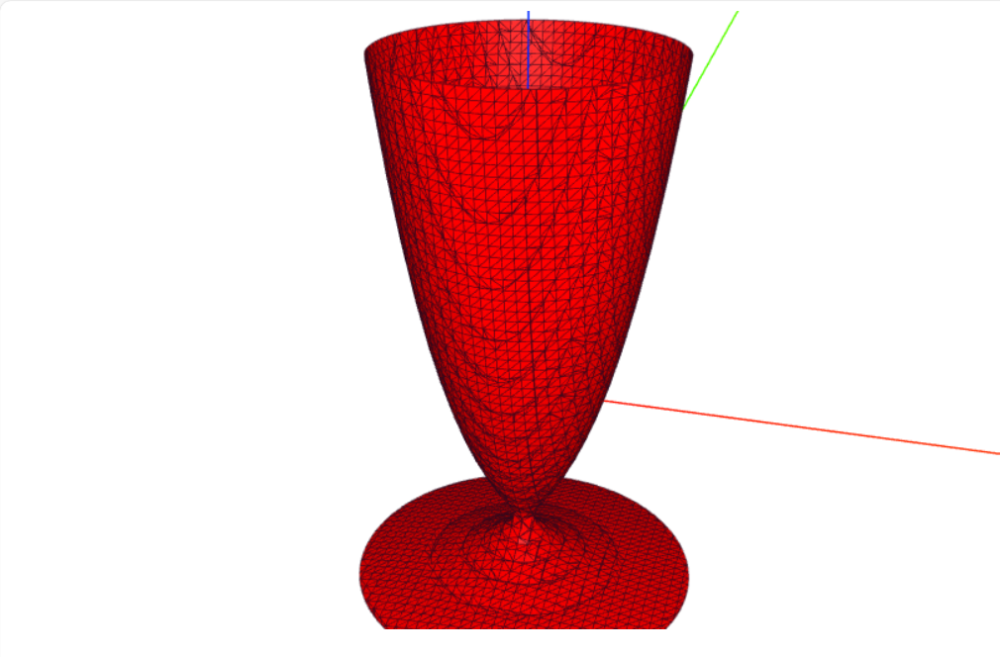
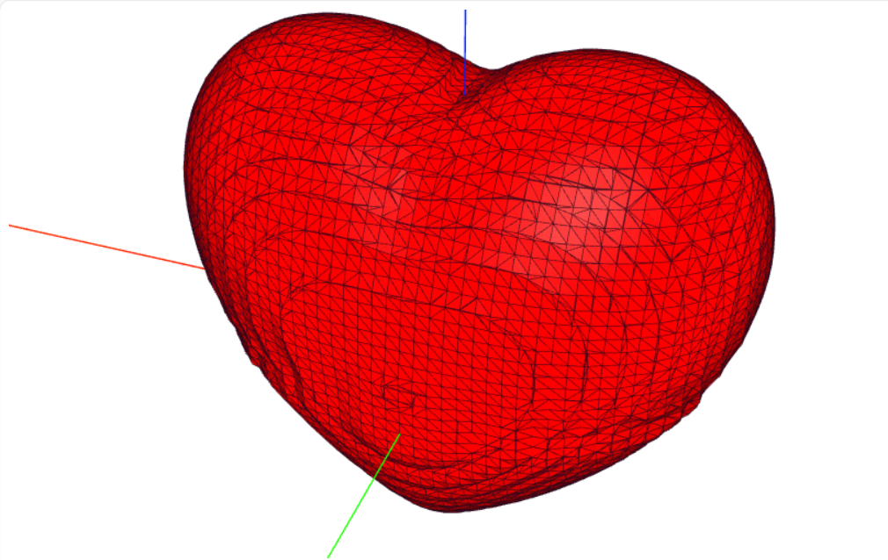
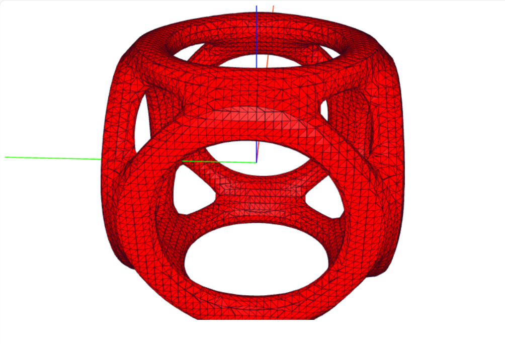
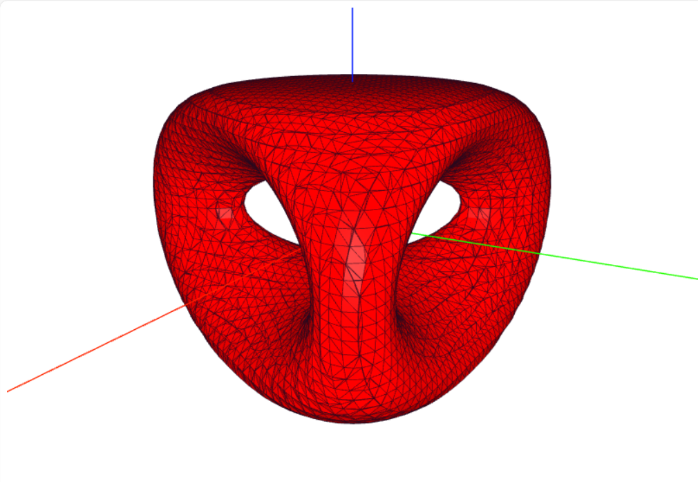
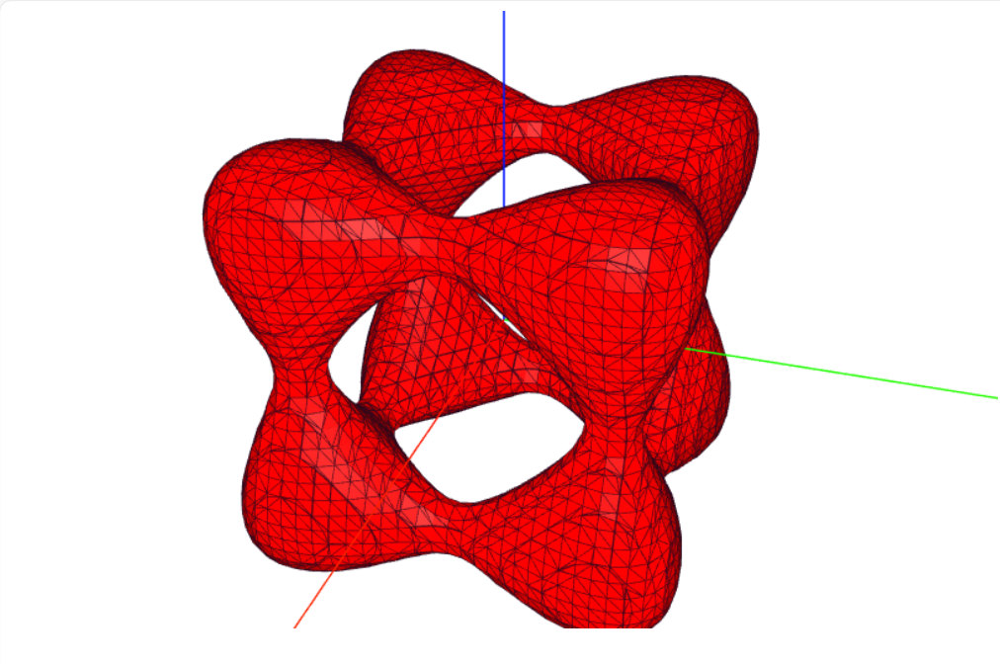
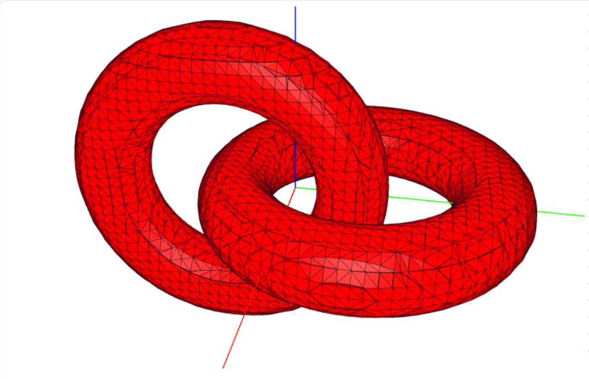

# Implicit Surface Plot

Based on interval subdivision algorithm and Marching Cubes algorithm.

[Online Demo](https://byx2000.github.io/implicit-surface-plot/)

$(\sqrt{x^2 + y^2} - 2)^2 + z^2 - 1=0$

$x^2 + y^2 - (\ln(z + 3.2))^2 - 0.02=0$

$243\left( \frac{x^2}{9} + \frac{y^2}{4} + \frac{z^2}{9} - 1 \right)^3 - x^2 z^3 - \frac{9}{80} y^2 z^3=0$

$\left[ \left( x^2 + y^2 - 5.76 \right)^2 + \left( z^2 - 9 \right)^2 \right]\cdot \left[ \left( y^2 + z^2 - 5.76 \right)^2 + \left( x^2 - 9 \right)^2 \right]\cdot \left[ \left( z^2 + x^2 - 5.76 \right)^2 + \left( y^2 - 9 \right)^2 \right]- 15943=0$

$y \left(y^2 - 3x^2\right) \left(36 - 9z^2\right) + \left(3x^2 + 3y^2\right)^2 - \left(9z^2 - 4\right) \left(36 - 9z^2\right)=0$

$x^4 - 5x^2 + y^4 - 5y^2 + z^4 - 5z^2 + 11.8=0$

$\left[ \left( 4x^2 + (2y - 2)^2 + 4z^2 + 12 \right)^2 - 53 \left( 4x^2 + (2y - 2)^2 \right) \right] \left[ \left( 4x^2 + (2y + 2)^2 + 4z^2 + 12 \right)^2 - 53 \left( 4z^2 + (2y + 2)^2 \right) \right] + 1000=0$

